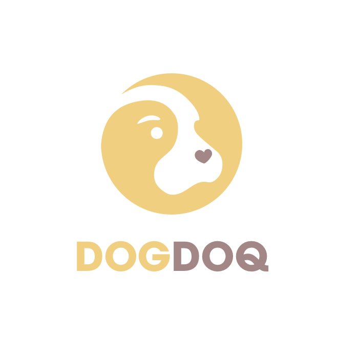

# 독돜 서버

[](https://expressjs.com/ko/)
[](https://fabric-sdk-node.github.io/release-1.4/index.html)
[](https://www.mysql.com/)

<p align="center" >

 <br/>
Dog + Documents = <b>DOGDOQ</b>
</p>

 Description
 -----------
 반려동물 분양과정 투명화를 위한 DOGDOQ 서버
 
 System Structure
 -----------------


 Run Server
 -------------
```bash
 ./start.sh
```
